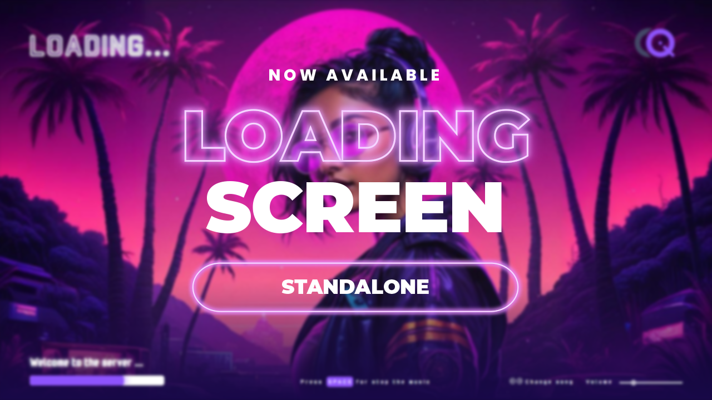

{/* --- */}
{/* title: CodeIQ Loading Screen */}
{/* --- */}

# CodeIQ Loading Screen

import { Steps } from 'nextra-theme-docs';
import { Callout } from 'nextra/components';
import Resource from '@components/Resource';

We present our free **loading screen** resource, in this file you will find everything you need to know about this resource.



## Features

The software allows users to select either a background image or a video. It also permits the addition of a server logo and provides an intuitive method for modifying the colors of the loading screen. Furthermore, it enables the incorporation of multiple audio files and offers comprehensive audio control, including the ability to stop, play, adjust the volume, and switch between audio sources.
## Configuration

<Steps>
### Set background
<Callout type="warning">

It is **important** to note that you can only have one of the two options enabled at the same time. If you want to change from one to the other, you must comment out the current option and uncomment the new one.

</Callout>

**File: `cq-loadingscreen/ui/index.html` - line: 15-16**

```html {15-16} showLineNumbers filename="index.html"
<!Doctype html>
<html lang="en">
    <head>
        <meta charset="UTF-8">
        <meta name="viewport" content="width=device-width, initial-scale=1">
        <title>CodeIQ - LoadingScreen</title>
        <link rel="preconnect" href="https://fonts.googleapis.com">
        <link rel="preconnect" href="https://fonts.gstatic.com" crossorigin>
        <link href="https://fonts.googleapis.com/css2?family=Monomaniac+One&display=swap" rel="stylesheet">
        <link rel="stylesheet" href="assets/css/styles.css">
    </head>
    <body>
        <audio id="music-player" src="" hidden loop></audio>

        <div class="bg-image"></div>
        <!-- <video autoplay loop muted class="bg-video" src="assets/video/..."></video> -->

        <div class="container">
            <div class="top-bar">
                <h1 id="loading-text" class="fill-text">LOADING...</h1>
                 <!-- Add your logo here -->
            </div>
            <div class="bottom-bar">
                <div class="progress">
                    <p>Welcome to the server ...</p>
                    <div class="progress-bar">
                        <div class="progress-bar-fill"></div>
                    </div>
                </div>
                <div class="pause-music">
                    <p>Press <span class="pause-control-key">SPACE</span> for <span class="pause-control-status">stop</span> the music</p>
                </div>
                <div class="music-control">
                    <div class="change-music">
                        <div class="change-music-buttons"> </div>
                        <p>Change song</p>
                    </div>
                    <div class="volume-music">
                        <p>Volume</p>
                        <label>
                            <input type="range" min="0" max="100" value="70" class="volume-slider" >
                        </label>
                    </div>
                </div>
            </div>
        </div>

        <script src="assets/js/app.js"></script>
    </body>
</html>
```

| Option  | Description                                                                                                                                                                                                                  |
|:--------|:-----------------------------------------------------------------------------------------------------------------------------------------------------------------------------------------------------------------------------|
| `image` | For change the image go to `cq-loadingscreen/ui/assets/css/styles.css` and change it on the line 31: `background-image: url('../images/bg.png');` |
| `video` | For set the video set the source path on the `src` attribute                                                                                      |

### Set server logo

**File: `cq-loadingscreen/ui/index.html` - line: 21**

```html {21} showLineNumbers filename="index.html"
<!Doctype html>
<html lang="en">
    <head>
        <meta charset="UTF-8">
        <meta name="viewport" content="width=device-width, initial-scale=1">
        <title>CodeIQ - LoadingScreen</title>
        <link rel="preconnect" href="https://fonts.googleapis.com">
        <link rel="preconnect" href="https://fonts.gstatic.com" crossorigin>
        <link href="https://fonts.googleapis.com/css2?family=Monomaniac+One&display=swap" rel="stylesheet">
        <link rel="stylesheet" href="assets/css/styles.css">
    </head>
    <body>
        <audio id="music-player" src="" hidden loop></audio>

        <div class="bg-image"></div>
        <!-- <video autoplay loop muted class="bg-video" src="assets/video/..."></video> -->

        <div class="container">
            <div class="top-bar">
                <h1 id="loading-text" class="fill-text">LOADING...</h1>
                 <!-- Add your logo here -->
            </div>
            <div class="bottom-bar">
                <div class="progress">
                    <p>Welcome to the server ...</p>
                    <div class="progress-bar">
                        <div class="progress-bar-fill"></div>
                    </div>
                </div>
                <div class="pause-music">
                    <p>Press <span class="pause-control-key">SPACE</span> for <span class="pause-control-status">stop</span> the music</p>
                </div>
                <div class="music-control">
                    <div class="change-music">
                        <div class="change-music-buttons"> </div>
                        <p>Change song</p>
                    </div>
                    <div class="volume-music">
                        <p>Volume</p>
                        <label>
                            <input type="range" min="0" max="100" value="70" class="volume-slider" >
                        </label>
                    </div>
                </div>
            </div>
        </div>

        <script src="assets/js/app.js"></script>
    </body>
</html>
```

| Attribute | Type     | Description                                          |
|:----------|:---------|:-----------------------------------------------------|
| `src`     | `string` | Set the route of your server logo here |

### Change Colors

**File: `cq-loadingscreen/ui/assets/css/styles.css` - line: 1**
```css showLineNumbers filename="styles.css"
  :root {
    --primary-color: #8E53FD;
    --secondary-color: #180848;
    --base-color: #FFF;
    --base-color-2: #e1e1e1;
    --global-background-color: #000;
}
```

### Config Audio Files

<Callout type="info">

Be sure to follow the steps below to add audio files to the loading screen.

</Callout>

<Steps>

### Add Audio Files to the Folder

Copy your audio files to the `cq-loadingscreen/ui/assets/audio` folder.

### Add Audio Files to the JSON

Go to `cq-loadingscreen/audios.json` file. This file is a JSON array with the audio files that will be loaded. You can add as many audio files as you want.

```json showLineNumbers filename="audios.json"
[
    "audio1.mp3",
    "audio2.mp3",
    "audio3.mp3"
]
```

</Steps>

</Steps>