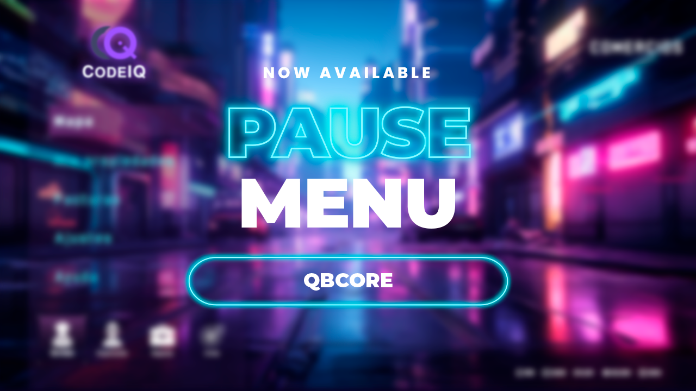

{/* --- */}
{/* title: CodeIQ Pause Menu */}
{/* --- */}

import { Callout } from 'nextra/components';

# CodeIQ Pause Menu

We are excited to introduce our **pause menu** script! This guide will walk you through configuring and customizing the resource to suit your needs.

## Features

The **pause menu** script offers:

- Customizable logos and background images.
- Sound effects for menu actions (hover, click, transitions).
- Configurable menu options with toggling features.
- Flexible shortcut options with icon-based customization.
- Integration with `cq-lib` for event-driven menu actions.

<Callout type="warning">

    This script requires **`cq-lib`** as a core dependency. Make sure it is installed and functional for the pause menu to work. You can find it on your [portal](https://portal.cfx.re/) assets category.

</Callout>